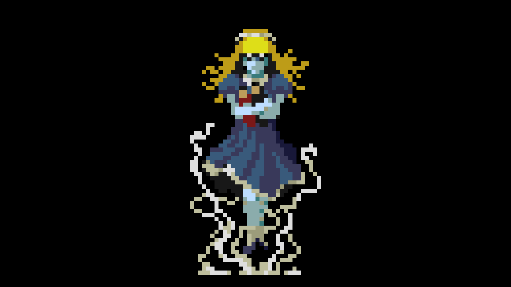
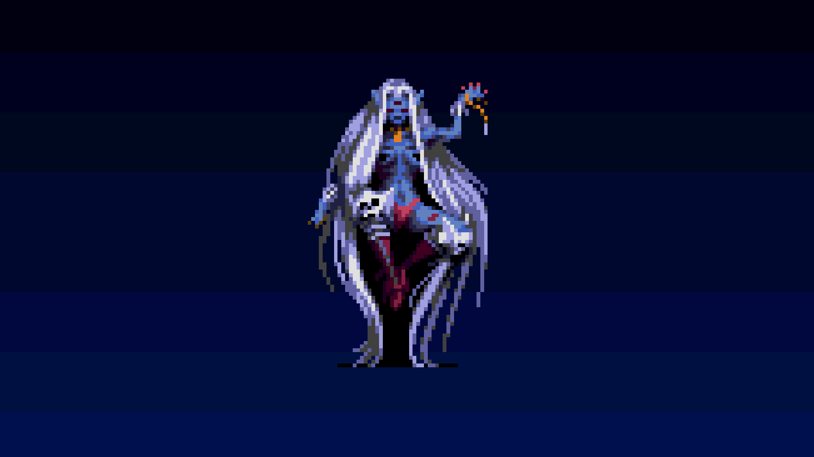
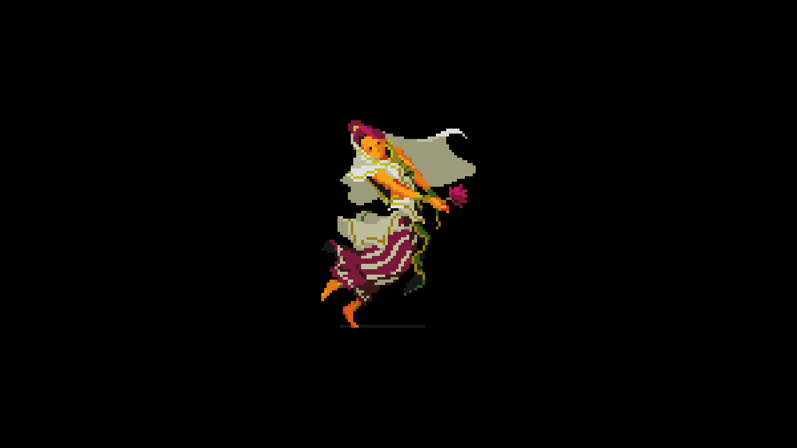
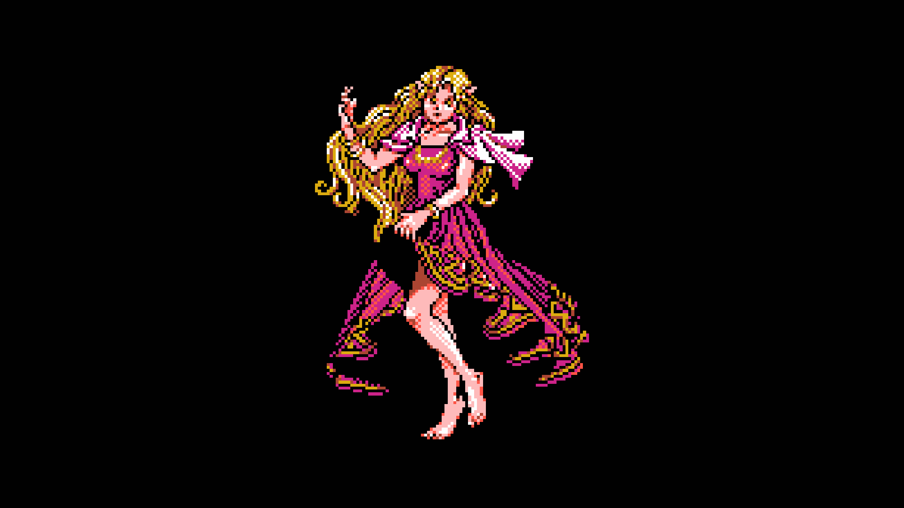
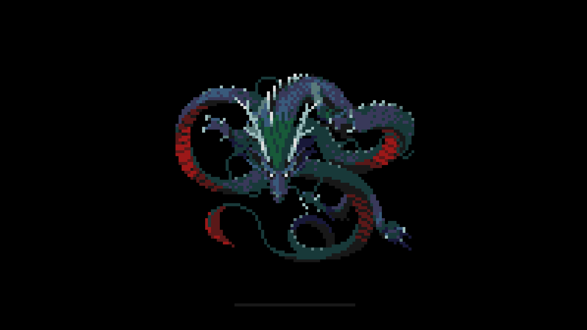
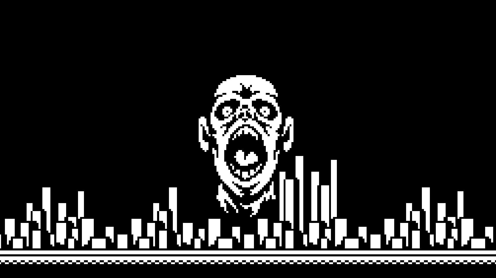
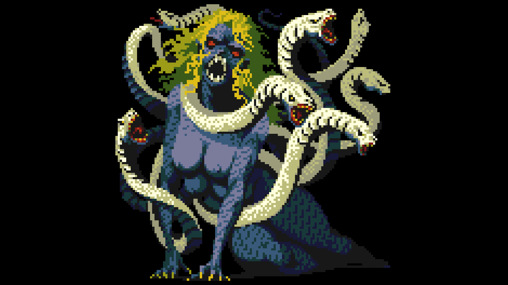
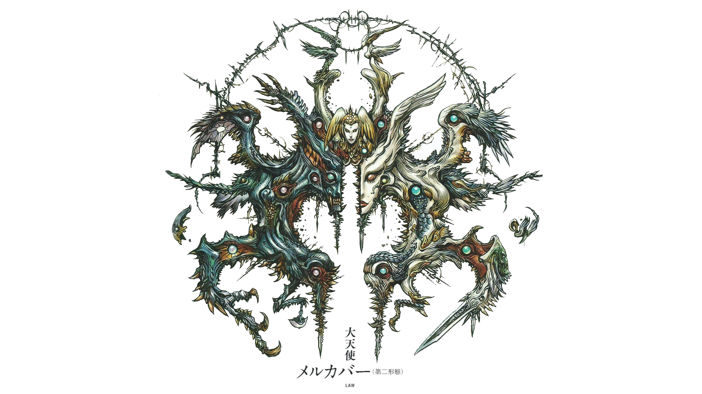

I’m a big nerd when it comes to Atlas JRPGs. They’ve developed nearly two Megami Tensei series games a year since they started back in 1987. The first game in the series that I played was Persona 3 FES, a spin-off of the Shin Megami Tensei main series of games. I’ve played Persona 4, SMTIV, and SMTIV: Apocalypse.

I couldn’t find any desktop backgrounds that I liked from the games so I made some of my own. I found some neat sprites from the SNES games and scaled them up to 1080p. here they are:

This last one is slightly NSFW.

BONUS MERKABAH!!:

