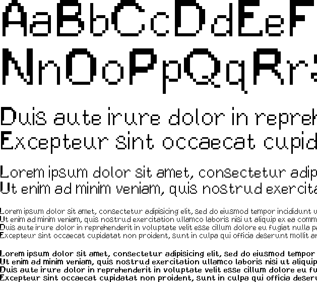
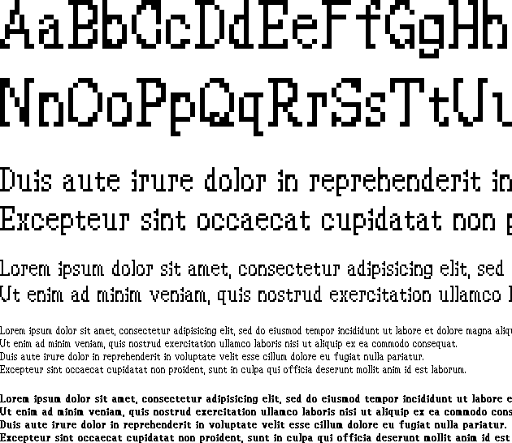
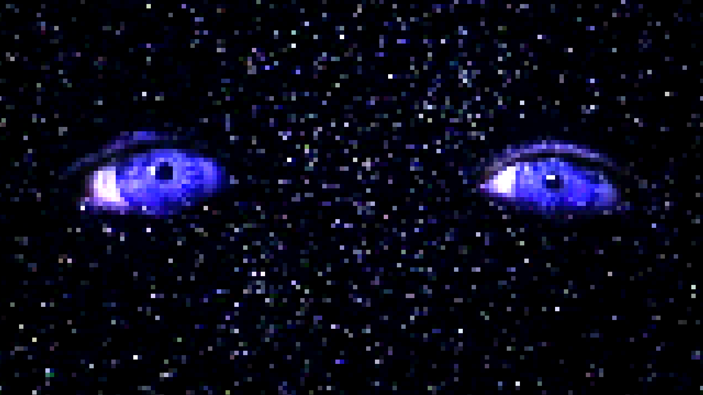

I wanted to share some of the fonts I’ve been making for my games. Here’s Atalanta and Rudras. I made them with [BITFONTMAKER2](http://www.pentacom.jp/pentacom/bitfontmaker2/), an awesome tool for anyone that wants to make a simple bitmap font. These fonts are free to use under the Creative Commons license so long as there is attribution, so feel free to include them in your own projects if you like.

## Atalanta

Atalanta is my first custom pixel font that I made for a platformer game.

**Download Atalanta [here](Atalanta_Font.zip).**

## Rudras

Rudras is based on the font used in the English fan translation of Rudra no Hihou, a SNES game from Square. I was inspired to create a magic spell creation system based on the Treasure of the Rudras mantra system and I decided I liked the font too. There are some changes, especially regarding the numbers, but the styling is consistent in most cases.

**Download Rudras [here](Rudras_Font.zip).**

#### Bonus Wallpaper

I adapted this from one scene in [Doctor Mordrid](https://youtu.be/42xdx4MZALQ).

